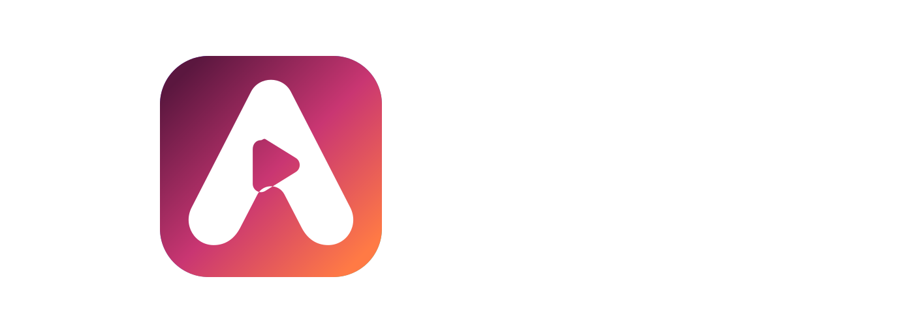
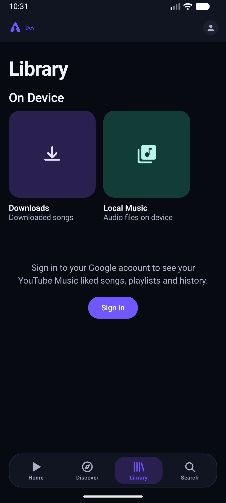
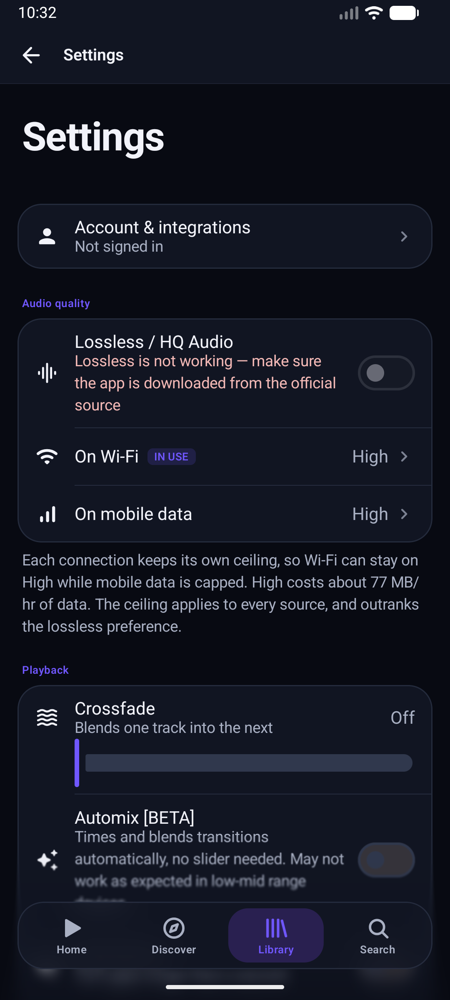

<div align="center">
  

  # Avyra

  An Android music player built around artwork, playback controls, and a clean library.

  [](https://github.com/Akihiro2004/Avyra/actions/workflows/android.yml)
  [](LICENSE)

  [Download](https://github.com/Akihiro2004/Avyra/releases/latest) · [Report a bug](https://github.com/Akihiro2004/Avyra/issues/new?template=bug_report.yml) · [Request a feature](https://github.com/Akihiro2004/Avyra/issues/new?template=feature_request.yml)
</div>

Avyra started from an earlier open-source music player, but it has grown into its own project with a new package, visual identity, playback work, and project direction. The original contributors are still credited in the Git history. I want this repository to be a place where people can understand the code, build it themselves, and help improve it.

Avyra is still a young project. Some integrations depend on third-party services that can change without warning, so please report breakage with logs and clear steps when possible.

## What it can do

- Search, browse, and play music through YouTube Music.
- Play local songs and show downloaded music from the device library.
- Save supported streams with artwork, tags, and embedded lyrics.
- Show line-synced and word-synced lyrics from several providers.
- Keep a local listening history and build Replay statistics.
- Use gapless playback, crossfade, playback speed, skip silence, sleep timer, and an equalizer.
- Run Automix experiments with local beat, vocal, and transition analysis.
- Use a configured module source for higher quality audio, with YouTube Music as a fallback.
- Connect optional Last.fm, ListenBrainz, and Discord integrations.
- Use animated artwork and colors taken from the current album cover.

<p align="center">
  
  
</p>

## Before installing

Avyra is an unofficial client. It is not affiliated with Google, YouTube, Spotify, Apple, Deezer, Discord, or any other service used by the app.

You are responsible for following the terms of the services you connect and the laws that apply where you live. The app does not host music. Downloaded files come from sources selected by the user, and those files are saved to the device's Music folder.

The Discord connection uses an account token for an unofficial Rich Presence connection. That can carry account and terms-of-service risk. Leave it disconnected if you are not comfortable with that.

## Build it locally

### Requirements

- Android Studio with Android SDK 36
- JDK 17
- Android NDK `27.0.12077973`
- CMake `3.22.1`
- Git

Android Studio can install the SDK, NDK, and CMake versions from SDK Manager. The Gradle wrapper is already included in the repository.

### Setup

```bash
git clone https://github.com/Akihiro2004/Avyra.git
cd Avyra
```

Open the folder in Android Studio and let it create `local.properties` with your Android SDK path. Optional settings can then be added to that same file. A safe template is available in [`local.properties.example`](local.properties.example).

The app builds without any optional service keys:

```powershell
.\gradlew.bat testProdReleaseUnitTest assembleDevDebug
```

On Linux or macOS:

```bash
./gradlew testProdReleaseUnitTest assembleDevDebug
```

The development APK will be written to `app/build/outputs/apk/dev/debug/`. Development builds use `com.avyra.music.dev`, while production builds use `com.avyra.music`.

### Optional local settings

| Name | What it is for |
| --- | --- |
| `MODULE_INDEX_URL` | Default module index used for optional audio sources |
| `AVYRA_UPDATE_API_URL` | GitHub latest-release API endpoint for update checks |
| `AVYRA_DISCORD_APPLICATION_ID` | Avyra-owned Discord application ID for Rich Presence |
| `LASTFM_API_KEY` | Last.fm API key |
| `LASTFM_SECRET` | Last.fm API secret |

Keep real values in `local.properties` or local environment variables. That file is ignored by Git. Do not put cookies, account tokens, signing passwords, or API secrets in a commit.

Release signing is optional for a local compile. See [`keystore.properties.example`](keystore.properties.example) if you need to make an installable release that can be updated later with the same key.

## How the app is arranged

Most of the application code is under `app/src/main/java/com/avyra/music`.

- `ui` contains the Compose screens, reusable components, theme, icons, and navigation state.
- `playback` contains the Media3 service, queue logic, caching, audio processors, and Automix planning.
- `data` contains network clients, models, settings, lyrics, listening stats, and source selection.
- `download` contains MediaStore writing and audio metadata tagging.
- `widget` contains the home-screen media widget.
- `app/src/main/cpp` contains the native analysis code used by Automix.

The normal playback path is UI to `MainViewModel`, then the media controller, `PlaybackService`, a selected source, the audio cache, and finally the Media3 player. Keeping the source resolver separate lets the player fall back when an optional source is unavailable.

## Contributing

Small fixes are welcome. Please read [`CONTRIBUTING.md`](CONTRIBUTING.md) before opening a pull request. It explains the build checks, code areas, and information that makes a bug report useful.

For general questions, read [`SUPPORT.md`](SUPPORT.md). Security problems should follow [`SECURITY.md`](SECURITY.md) and should not be posted in a public issue.

## License and credits

Avyra's original project code is distributed under the [GNU General Public License version 3](LICENSE). Some Automix files were adapted from Orchard and remain under the GNU Affero General Public License version 3 or later. The AGPL requirements described by section 13 apply to the combined program. See [`THIRD_PARTY_NOTICES.md`](THIRD_PARTY_NOTICES.md) and the file headers for the exact boundaries.

The repository also includes or depends on work from projects such as Orchard, Beat This!, Open-Unmix, Kizzy, NewPipeExtractor, AndroidX, Kotlin, Media3, Coil, Ktor, and ONNX Runtime. Their authors and licenses belong to them.

Avyra is maintained as an independent project. The name and logo policy is in [`TRADEMARKS.md`](TRADEMARKS.md).
